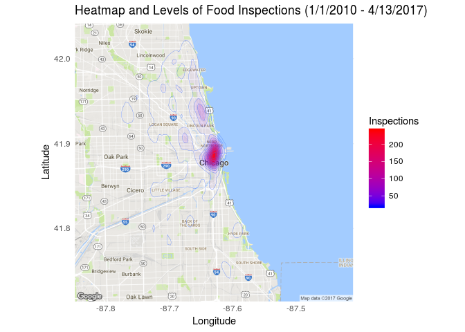
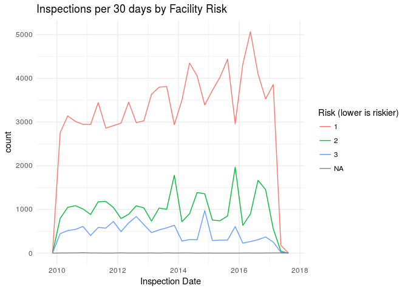
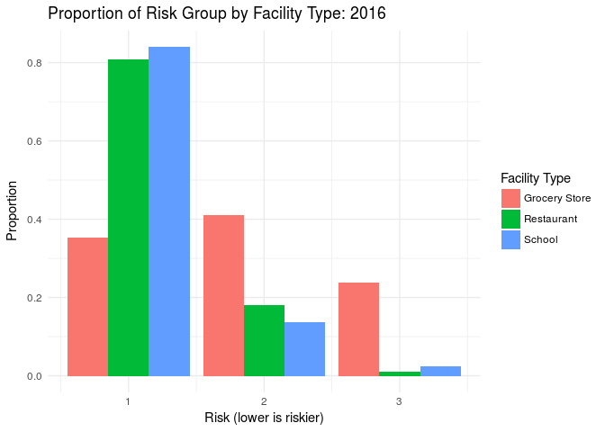

Perspectives Research Problem Set 1
================
Julian McClellan
Due 4/19/17

Food Inspections Data
=====================

The data is drawn from inspections of restaurants and other food establishments in Chicago from January 1, 2010 to the present (April 13, 2017). The data encompasses 146,821 inspections.

Inspections are performed by staff from the Chicago Department of Public Health’s Food Protection Program using a standardized procedure. The results of the inspection are inputted into a database, then reviewed and approved by a State of Illinois Licensed Environmental Health Practitioner. The data is available on [Chicago's open data portal](https://data.cityofchicago.org/Health-Human-Services/Food-Inspections/4ijn-s7e5/data). A [detailed description](https://data.cityofchicago.org/api/assets/BAD5301B-681A-4202-9D25-51B2CAE672FF) of the variables is also available.

At a meeting of the American Public Health Association, (Schenk 2015) described an [open source project](https://github.com/Chicago/food-inspections-evaluation) in which:

> \[T\]he City of Chicago’s Department of Innovation and Technology (DoIT), in collaboration with an insurance company, and the CDPH, together developed advanced analytics to forecast food establishments that are most likely to have critical violations, which are most likely to contribute to food borne illness, so that they may be inspected first.

Making a *single* descriptive statistics table isn't exactly the most helpful thing given that the majority of the variables of categorical with differing numbers of categories, but here you go:

<table style="width:100%;">
<colgroup>
<col width="12%" />
<col width="7%" />
<col width="3%" />
<col width="18%" />
<col width="10%" />
<col width="16%" />
<col width="13%" />
<col width="16%" />
</colgroup>
<thead>
<tr class="header">
<th align="left">Categorical Variables</th>
<th align="right">unique Values</th>
<th align="right"># NA</th>
<th align="right">Median inspections per unique value</th>
<th align="left">Most Frequent Value</th>
<th align="left">Most Frequent Value Proportion</th>
<th align="left">Least Frequent Value</th>
<th align="left">Least Frequent Value Proportion</th>
</tr>
</thead>
<tbody>
<tr class="odd">
<td align="left">License #</td>
<td align="right">32028</td>
<td align="right">14</td>
<td align="right">3</td>
<td align="left">0</td>
<td align="left">0.287%</td>
<td align="left">1</td>
<td align="left">0.001%</td>
</tr>
<tr class="even">
<td align="left">Legal Name</td>
<td align="right">24134</td>
<td align="right">0</td>
<td align="right">4</td>
<td align="left">SUBWAY</td>
<td align="left">1.385%</td>
<td align="left">1021 MONTROSE</td>
<td align="left">0.001%</td>
</tr>
<tr class="odd">
<td align="left">Public Name</td>
<td align="right">23071</td>
<td align="right">2696</td>
<td align="right">4</td>
<td align="left">SUBWAY</td>
<td align="left">1.692%</td>
<td align="left">1021 MONTROSE</td>
<td align="left">0.001%</td>
</tr>
<tr class="even">
<td align="left">Facility Type</td>
<td align="right">438</td>
<td align="right">4540</td>
<td align="right">4</td>
<td align="left">Restaurant</td>
<td align="left">67.599%</td>
<td align="left">AFTER SCHOOL CARE</td>
<td align="left">0.001%</td>
</tr>
<tr class="odd">
<td align="left">Risk (lower = riskier)</td>
<td align="right">4</td>
<td align="right">79</td>
<td align="right">22302</td>
<td align="left">1</td>
<td align="left">69.604%</td>
<td align="left">3</td>
<td align="left">9.613%</td>
</tr>
<tr class="even">
<td align="left">City</td>
<td align="right">51</td>
<td align="right">150</td>
<td align="right">2</td>
<td align="left">CHICAGO</td>
<td align="left">99.866%</td>
<td align="left">BLOOMINGDALE</td>
<td align="left">0.001%</td>
</tr>
<tr class="odd">
<td align="left">Zip Code</td>
<td align="right">100</td>
<td align="right">98</td>
<td align="right">1100</td>
<td align="left">60614</td>
<td align="left">3.712%</td>
<td align="left">60018</td>
<td align="left">0.001%</td>
</tr>
<tr class="even">
<td align="left">Inspection Type</td>
<td align="right">109</td>
<td align="right">1</td>
<td align="right">1</td>
<td align="left">Canvass</td>
<td align="left">53.233%</td>
<td align="left">1315 license reinspection</td>
<td align="left">0.001%</td>
</tr>
<tr class="odd">
<td align="left">Inspection Results</td>
<td align="right">7</td>
<td align="right">0</td>
<td align="right">13407</td>
<td align="left">Pass</td>
<td align="left">58.920%</td>
<td align="left">BusinessNotLocated</td>
<td align="left">0.041%</td>
</tr>
</tbody>
</table>

Of course, this summary table can only tell us so much. What about where and when these inspections take place?

However, one might also be interested in what facility types typically have higher risk, and in looking at specific years for the data. There are over 400 facility types, but let's compare restaurants, grocery stores, and schools in 2016: 

Looking at this visualization, around 80% of restaurants and schools inspected in Chicago in 2016 were in the highest risk group (poor kids). Also, compared to the timeseries shown above, this visualization tells us that although a risk level of 1 (highest risk) is the most prevalent in the data, that this does not necessarily hold true within individual facility types. Also, along with the first summary table given, one might infer that the reason that risk level 1 food inspections dominate is due to the plurality (~67% of all observations) that restaurants hold in the data. One might expect then, that there are more nuances to tease out.

------------------------------------------------------------------------

Schenk, Tom. 2015. “Food Inspection Forecasting to Optimize Inspections with Analytics.” In *2015 Apha Annual Meeting & Expo (Oct. 31-Nov. 4, 2015)*. APHA.
